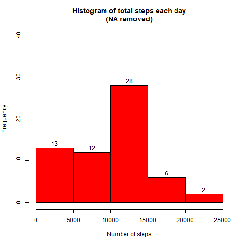
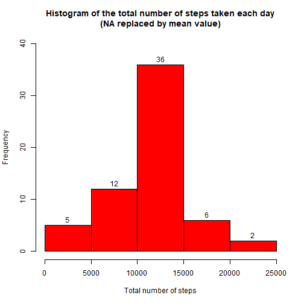
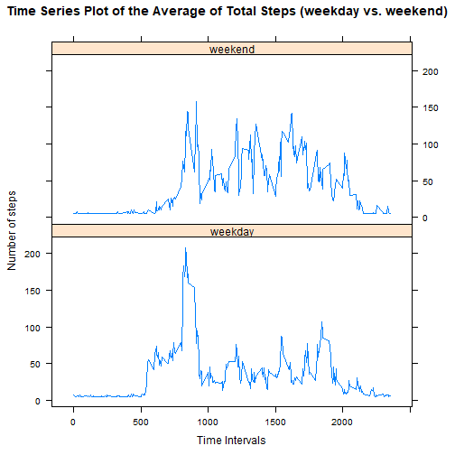

#Reproducible Research: Peer Assessment 1

It is now possible to collect a large amount of data about personal movement using activity monitoring devices such as a Fitbit, Nike Fuelband, or Jawbone Up. These type of devices are part of the quantified self movement, ie, a group of enthusiasts who take measurements about themselves regularly to improve their health, to find patterns in their behavior, or because they are tech geeks. But these data remain under-utilized both because the raw data are hard to obtain and there is a lack of statistical methods and software for processing and interpreting the data.

This assignment makes use of data from a personal activity monitoring device. This device collects data at 5 minute intervals through out the day. The data consists of two months of data from an anonymous individual collected during the months of October and November, 2012 and include the number of steps taken in 5 minute intervals each day.

## Data
The data for this assignment was downloaded from the course web
site:

* Dataset: [Activity monitoring data](https://d396qusza40orc.cloudfront.net/repdata%2Fdata%2Factivity.zip) [52K]

The variables included in this dataset are:

* **steps**: Number of steps taking in a 5-minute interval (missing
    values are coded as `NA`)

* **date**: The date on which the measurement was taken in YYYY-MM-DD
    format

* **interval**: Identifier for the 5-minute interval in which
    measurement was taken

The dataset is stored in a comma-separated-value (CSV) file and there are a total of 17,568 observations in this dataset.

### Loading and preprocessing the data
#### set and load data
1. Set working directory and load the data

```r
setwd("C:/Users/MULBE/Documents")
rawdata <- read.csv("activity.csv")
```

2. Process/transform the data into a format suitable for analysis
Transform the date attribute to an actual date format

```r
rawdata$date <- as.POSIXct(rawdata$date, format="%Y-%m-%d")
```

3. Compute the weekdays from the date attribute

```r
raw_activity <- data.frame(date=rawdata$date,                                               weekday=tolower(weekdays(rawdata$date)), 
                           steps=rawdata$steps, 
                           interval=rawdata$interval)
```

4. Compute the type of day (whether is it weekday or weekend)

```r
raw_activity <- cbind(raw_activity, 
              daytype=ifelse(raw_activity$weekday == "saturday" | 
                             raw_activity$weekday == "sunday", "weekend", 
                                     "weekday"))
```

5. Create the data file

```r
datafile <- data.frame(date=raw_activity$date, 
                       weekday=raw_activity$weekday, 
                       daytype=raw_activity$daytype, 
                       interval=raw_activity$interval,
                       steps=raw_activity$steps)
```
### What is mean total number of steps taken per day
For this part of the assignment, you can ignore the missing values in the dataset.

* Make a histogram of the total number of steps taken each day


```r
datafile1 <- aggregate(datafile$steps, by=list(datafile$date), FUN=sum, na.rm=TRUE)
names(datafile1) <- c("date", "total")
```

* display the first few rows of the sum_data data frame:

```r
head(datafile1)
```

```
##         date total
## 1 2012-10-01     0
## 2 2012-10-02   126
## 3 2012-10-03 11352
## 4 2012-10-04 12116
## 5 2012-10-05 13294
## 6 2012-10-06 15420
```
1. Compute the histogram of the total number of steps each day

```r
hist(datafile1$total, 
     col="red", 
     xlab="Number of steps", 
     ylim=c(0, 40), labels = TRUE,
     main="Histogram of total steps each day\n(NA removed)")
```



2. The main difference between a histogram and a barplot is that for barplot, each column represents a group defined by a categorical variable; while for histograms, each column represents a group defined by a continuous, quantitative variable.


3. Calculate and report the mean and median of total steps taken per day

```r
mean(datafile1$total)
```

```
## [1] 9354.23
```

```r
median(datafile1$total)
```

```
## [1] 10395
```
* Answer:  These formulas gives a mean and median of 9354 and 10395 respectively.


### What is the average daily activity pattern?

```r
# Calculate average steps for each interval for all days. 
mean_steps <- aggregate(x=list(steps=datafile$steps), by=list(interval=datafile$interval),
                      FUN=mean, na.rm=TRUE)
```

1. Plot the Average Number Steps per Day by Interval.

```r
library(ggplot2)
ggplot(data=mean_steps, aes(interval,steps)) +
    geom_line() +
    xlab("5-minute interval") +
    ylab("Average number of steps taken")+
    ggtitle("Time-series of the average number of steps per intervals\n(NA removed)")
```


2. Which 5-minute interval, on average across all days, contains the max number of steps?

```r
max_interval <- mean_steps$interval[which(mean_steps$steps == max(mean_steps$steps))]
max_interval
```

```
## [1] 835
```

* Maximun number of step is 835.

### Imputing missing values
1. Calculate and report the total number of missing values in the dataset (i.e. the total number of rows with NAs)

```r
NA_count <- sum(is.na(datafile$steps))
NA_count
```

```
## [1] 2304
```
* Number of missing values in the dataset is 'r NA_count'

2. Devise a strategy for filling in all of the missing values in the dataset. The strategy does not need to be sophisticated. For example, you could use the mean/median for that day, or the mean for that 5-minute interval, etc.


```r
# Find the NA positions
na_pos <- which(is.na(datafile$steps))

# Create a vector of means
mean_na <- rep(mean(datafile$steps, na.rm=TRUE), times=length(na_pos))
```
* The strategy We use is to replace each NA value by the mean of the steps attribute. 


3. Create a new dataset that is equal to the original dataset but with the missing data filled in.


```r
# Replace the NAs by the means
datafile[na_pos, "steps"] <- mean_na


# Display the first few rows of the new activity data frame:
head(datafile)
```

```
##         date weekday daytype interval   steps
## 1 2012-10-01  monday weekday        0 37.3826
## 2 2012-10-01  monday weekday        5 37.3826
## 3 2012-10-01  monday weekday       10 37.3826
## 4 2012-10-01  monday weekday       15 37.3826
## 5 2012-10-01  monday weekday       20 37.3826
## 6 2012-10-01  monday weekday       25 37.3826
```

4. Make a histogram of the total number of steps taken each day and calculate and report the mean and median total number of steps taken per day. Do these values differ from the estimates from the first part of the assignment? What is the impact of imputing missing data on the estimates of the total daily number of steps?


```r
# Compute the total number of steps each day (NA values removed)
datafile2 <- aggregate(datafile$steps, by=list(datafile$date), FUN=sum)

# Rename the attributes
names(datafile2) <- c("date", "total")

# Compute the histogram of the total number of steps each day
hist(datafile2$total, 
     col="red", 
     xlab="Total number of steps", 
     ylim=c(0, 40), labels = TRUE,
     main="Histogram of the total number of steps taken each day\n(NA replaced by mean value)")
```



```r
mean(datafile2$total)
```

```
## [1] 10766.19
```

```r
median(datafile2$total)
```

```
## [1] 10766.19
```

* Answer: Mean and median values are higher after imputing missing data. The reason is in the original data file, there are some days with value=NA in steps for any interval. The number of steps taken in these days are default to 0s value. But after replacing these missing steps values with the mean steps of associated interval value, these 0 values are removed from the histogram of total number of steps taken each day


### Are there differences in activity patterns between weekdays and weekends?
1. Create a new factor variable known as daytype in the dataset with two levels - weekdays and weekend indicating whether a given date is a weekday or weekend day.


```r
# The new factor variable "daytype" was already in the activity data frame
head(datafile)
```

```
##         date weekday daytype interval   steps
## 1 2012-10-01  monday weekday        0 37.3826
## 2 2012-10-01  monday weekday        5 37.3826
## 3 2012-10-01  monday weekday       10 37.3826
## 4 2012-10-01  monday weekday       15 37.3826
## 5 2012-10-01  monday weekday       20 37.3826
## 6 2012-10-01  monday weekday       25 37.3826
```

2.Make a panel plot containing a time series plot (i.e. type = "l") of the 5- minute interval (x-axis) and the average number of steps taken, averaged across all weekday days or weekend days (y-axis).


```r
# Compute the average number of steps taken, averaged across all daytype variable
library(lattice)
```

```
## Warning: package 'lattice' was built under R version 3.5.2
```

```r
datafile3 <- aggregate(steps ~ interval + daytype, datafile, mean, na.rm = TRUE)

# List 1st few rows of the datafile3
head(datafile3)
```

```
##   interval daytype    steps
## 1        0 weekday 7.006569
## 2        5 weekday 5.384347
## 3       10 weekday 5.139902
## 4       15 weekday 5.162124
## 5       20 weekday 5.073235
## 6       25 weekday 6.295458
```

```r
xyplot(steps ~ interval | daytype, datafile3, 
       type="l", 
       lwd=1, 
       xlab="Time Intervals", 
       ylab="Number of steps", 
       main="Time Series Plot of the Average of Total Steps (weekday vs. weekend)",
       layout=c(1,2))
```


